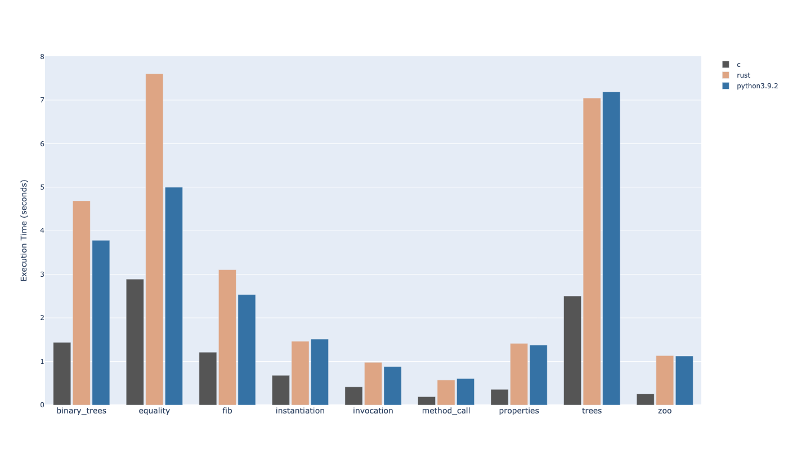

## 1.0.0

This is the initial completely safe version of Rust with liberal usage of `Rc` for objects. Even though I can guarantee
that the objects will never be dropped as long as they are on stack, transcribing them with lifetime parameters is not
something for the mere mortal like me so `Rc` it is for me (with the aid of `RefCell` and `Cell`). The only optimization
available on this version is the usage of [`ahash`](https://crates.io/crates/ahash) which seems to improve the speed by >10%.
As you can see, it's not great, especially `equality` which seems to take 6x longer than C version.

## 1.0.1

From the graph, it looks like there's an outlier in `equality` test. It appeared that there's a lot of allocation
going on in that benchmark and I wasn't interning any constant string so for every string access, rust version was
allocating them on the heap. I've added a new interned  string which is just a static reference to the constant string 
in the function. Since I'm already leaking the main function at the beginning, this was relatively easy to change.

But the bad news is that I discovered it's possible to leak memory by creating cycles between two instances since
I am using strong Rc pointers for storing reference to instance field.

## Unsafe

There's an unsafe (and not very readable, sorry!) version at the branch `unsafe-optimization` where I've applied
a few optimization at the cost of safety. They include but not limited to avoiding `Rc` but instead use normal `Box` 
and pointers, using stack and callframe pointers to match more closely to the textbook clox implementation. They perform
better compared to the safe version.

