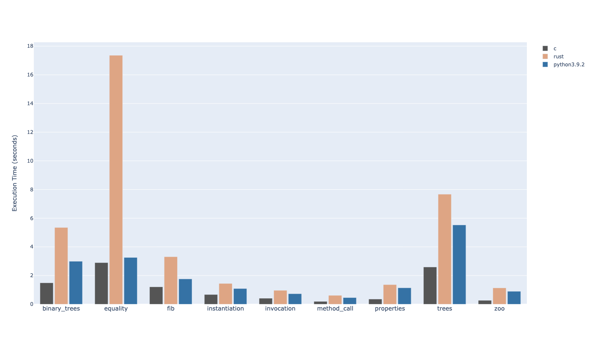

## 1.0.0

This is the initial completely safe version of Rust with liberal usage of `Rc` for objects. Even though I can guarantee
that the objects will never be dropped as long as they are on stack, transcribing them with lifetime parameters is not
something for the mere mortal like me so `Rc` it is for me (with the aid of `RefCell` and `Cell`). The only optimization
available on this version is the usage of [`ahash`](https://crates.io/crates/ahash) which seems to improve the speed by >10%.
As you can see, it's not great, especially `equality` which seems to take 6x longer than C version.

